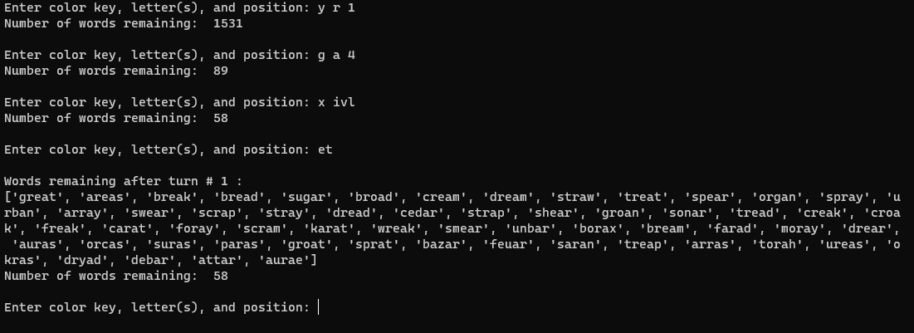

# wordle-solver
A way to cheat at wordle

## How To Use
Run the tool from the command line invoking your system's python interpreter. For example:
```python solver.py```

The tool waits for user inputs which it expects in the following format:
```<Color Key> <Letter String> <Position>```

There are also a few special commands:
- ```exit``` will exit the tool
- ```ET``` or ```et``` for "end turn" will tell the tool that you have finished your inputs for the current guess. It
prints out the remaining word list in preparation for the next turn.

Green and yellow letters must be input one at a time with their corresponding positions; however, multiple gray letters can be input at once. See examples below.

Keys are not case sensitive - the tool will accept both upper and lower case letters.

The color keys are as follows:
- **G** represents a **green** letter
- **Y** represents a **yellow** letter
- Either **X** or **B** can be used for gray letters (because G is already taken - use X for miss or B for black)

**Letter Strings** are simply the letter or letters that have turned the given color during the current turn. As previously
mentioned, gray missed letters can be input all at once. However, green and yellow letters must be input one at a time
along with their corresponding positions.

The **Position** is the space at which the letter either turned green or yellow. It is an integer between 1 and 5.

### Examples Of Use
Suppose the user guessed the word RIVAL to begin the game:


To input the letter **R** as having appeared as yellow in the first position, the user would issue this command:
```Y R 1```
This signifies that a **yellow** letter **R** appeared in position **1**.

Next, to input the green **A** the user would input ```G A 4``` to tell the tool that the **green** letter **A** was
found in position **4**.

To input the gray missed letters, a single command can be input: ```X IVL``` tells the tool that the letters **I**,
**V** and **L** were all not found in the word, signified by the **X** color key.

The order of inputs does not matter within a turn - the user can input colors and letters in any order.
To end the first turn and display a list of remaining words, the user would input ```ET```

Below is a capture of a terminal with these inputs:



The tool will continue waiting for user input until the ```exit``` command is input.

